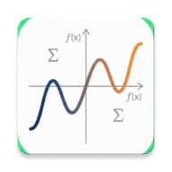

# Math Graph Study

<p align="center">
  
</p>

<p align="center">
  <strong>수학 함수를 시각적으로 탐구하는 Android 그래프 계산기</strong>
</p>

<p align="center">
  <a href="#주요-기능">주요 기능</a> •
  <a href="#스크린샷">스크린샷</a> •
  <a href="#기술-스택">기술 스택</a> •
  <a href="#아키텍처">아키텍처</a> •
  <a href="#시작하기">시작하기</a>
</p>

---

## 📱 소개

**Math Graph Study**는 수학 함수를 직관적으로 입력하고 실시간으로 그래프를 시각화할 수 있는 Android 애플리케이션입니다. 외부 차트 라이브러리를 사용하지 않고 **Jetpack Compose Canvas**를 활용하여 그래프 렌더링 엔진을 직접 구현했습니다.

수학 학습자, 학생, 교육자를 위해 설계되었으며, 복잡한 수식도 손쉽게 시각화하여 함수의 특성을 이해할 수 있습니다.

---

## 📸 스크린샷

| 메인 화면 | 그래프 뷰 | 함수 입력 |
|:---:|:---:|:---:|
|  |  |  |

---

## ✨ 주요 기능

### 함수 입력 및 관리
- **자유 수식 입력**: `sin(x) + x^2`, `2x + 1`, `ln(x)` 등 다양한 수식 지원
- **초보자 모드**: 일차/이차/삼차/유리 함수의 계수만 입력하여 간편하게 그래프 생성
- **다중 함수 지원**: 여러 함수를 동시에 그래프에 표시
- **함수 관리**: 색상 자동 지정, 가시성 토글, 함수 삭제

### 지원 수학 표현
| 연산자 | 함수 | 상수 |
|--------|------|------|
| `+`, `-`, `*`, `/`, `^` | `sin`, `cos`, `tan` | `e` |
| 암시적 곱셈 (`2x` → `2*x`) | `log`, `ln`, `exp` | `pi` |
| 괄호 `()` | `sqrt`, `abs` | - |

### 그래프 뷰어
- **커스텀 Canvas 렌더링**: Jetpack Compose Canvas로 직접 구현
- **Pinch-to-Zoom**: 핀치 제스처로 확대/축소
- **Pan 제스처**: 드래그로 화면 이동
- **동적 그리드**: 줌 레벨에 따른 자동 그리드/축 라벨 조정
- **교차점 계산**: 함수 간 교차점 자동 탐지 및 표시

---

## 🛠 기술 스택

| 분류 | 기술 |
|------|------|
| **Language** | Kotlin |
| **UI Framework** | Jetpack Compose |
| **Architecture** | MVVM + Clean Architecture + State Hoisting |
| **DI** | Hilt |
| **Async** | Kotlin Coroutines & Flow |
| **Math Engine** | 자체 구현 (Shunting-yard Algorithm) |
| **Graph Rendering** | Compose Canvas (외부 라이브러리 미사용) |
| **Monetization** | Google AdMob |
| **Min SDK** | 26 (Android 8.0) |
| **Target SDK** | 36 |

---

## 🏛 아키텍처

```
app/
├── domain/
│   ├── model/           # 도메인 모델 (GraphFunction, ExpressionNode)
│   │   └── math/        # 수학 관련 모델 (VisualMathNode, MathOperator)
│   ├── service/         # MathParser (수식 파싱 엔진)
│   └── usecase/         # CalculateIntersectionsUseCase
│
├── presentation/
│   ├── components/      # UI 컴포넌트 (GraphCanvas, FunctionItem 등)
│   ├── designsystem/    # 테마, 색상, 타이포그래피
│   ├── graph/           # 메인 그래프 화면 (ViewModel, State, Action)
│   ├── license/         # 오픈소스 라이선스 화면
│   └── math/            # 수학 입력 관리 (MathInputManager)
│
└── util/                # AdManager 등 유틸리티
```

### 핵심 설계

1. **MathParser**: Shunting-yard 알고리즘을 사용해 중위 표기법을 후위 표기법(RPN)으로 변환 후 AST 구성
2. **VisualMathNode ↔ ExpressionNode**: UI 표현용 노드와 계산용 노드 분리
3. **GraphCanvas**: 픽셀 단위 렌더링, 불연속점 처리, 동적 그리드 생성
4. **CalculateIntersectionsUseCase**: 뷰포트 범위 내 함수 교차점 비동기 계산

---

## 📝 라이선스

이 프로젝트는 오픈소스 라이브러리를 사용합니다. 앱 내 설정에서 오픈소스 라이선스를 확인할 수 있습니다.

---

## 👤 개발자

**허준서 (DevHJS)**

- GitHub: [@Junseo0324](https://github.com/Junseo0324)

---

<p align="center">
  Made with ❤️ and Jetpack Compose
</p>
