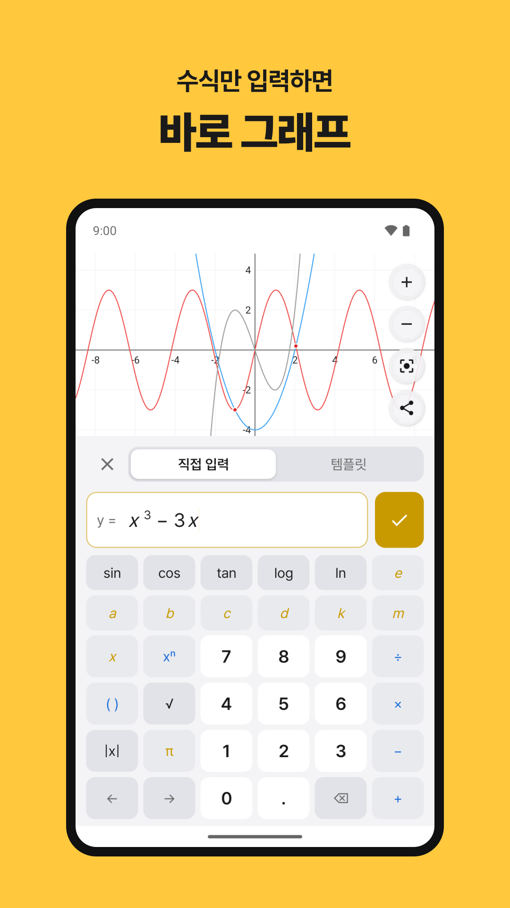
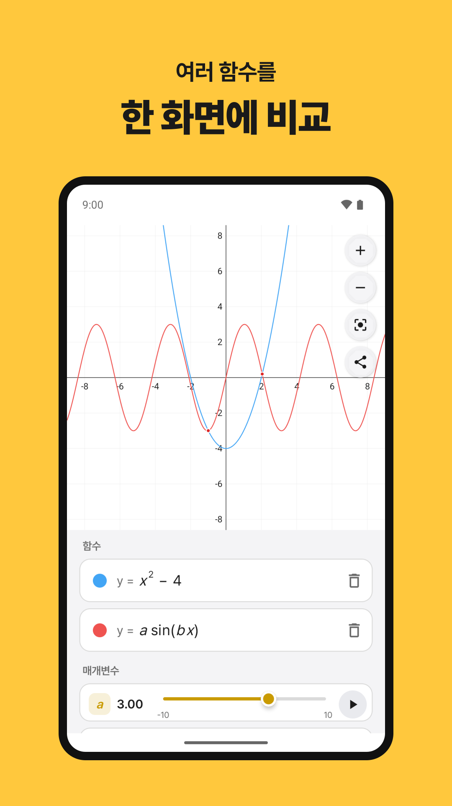
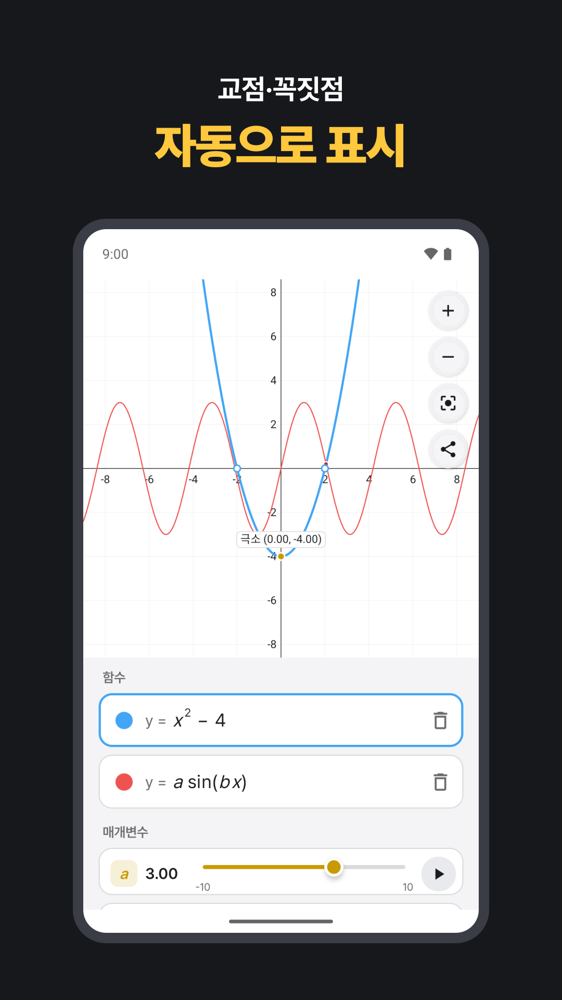
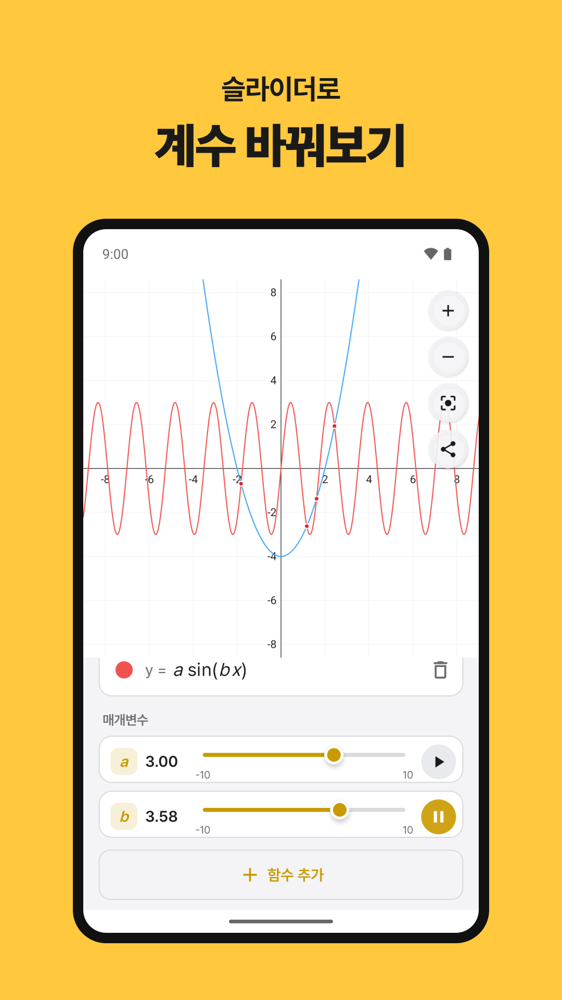
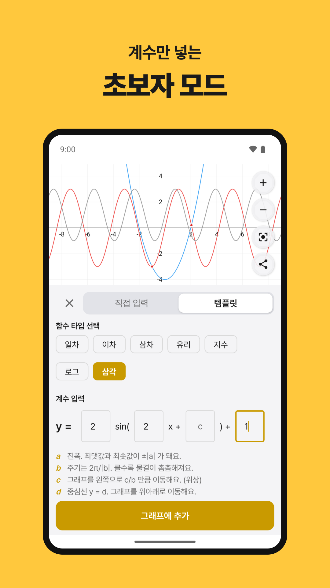
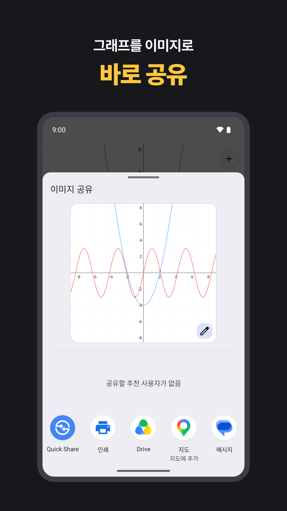
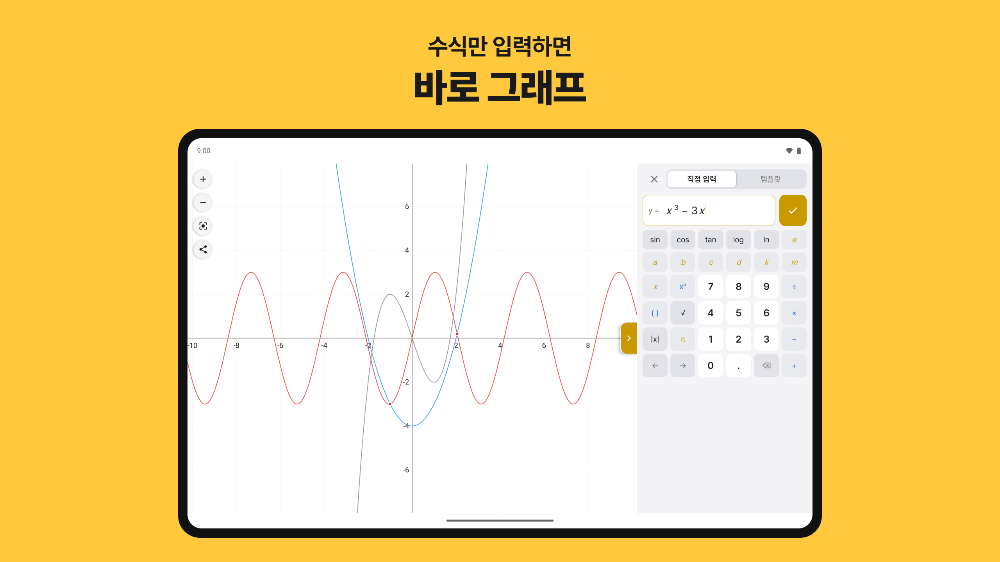

# Math Graph Study
---

## 📱 소개

**Math Graph Study**는 중·고등학생을 위한 함수 그래프 학습 앱입니다. 수식을 입력하면 바로 그래프가 그려지고, 교점·꼭짓점 같은 특징점을 확인하거나 슬라이더로 계수를 바꿔 보며 함수의 모양이 어떻게 변하는지 직접 관찰할 수 있습니다.

외부 차트 라이브러리를 사용하지 않고 **Jetpack Compose Canvas**로 그래프 렌더링 엔진을, **Shunting-yard 알고리즘**으로 수식 파서를 직접 구현했습니다.

---

## 📸 스크린샷

### 휴대폰

| 수식 입력 | 여러 함수 비교 | 교점·꼭짓점 |
|:---:|:---:|:---:|
|  |  |  |

| 매개변수 슬라이더 | 템플릿 입력 | 이미지 공유 |
|:---:|:---:|:---:|
|  |  |  |

### 태블릿 · 가로 모드



---

## ✨ 주요 기능

### 함수 입력
- **직접 입력**: 계산기처럼 고정 키패드로 한 줄씩 입력합니다. 수식을 탭하면 커서가 그 위치로 이동하고, 입력하는 동안 그래프에 미리보기 곡선이 실시간으로 그려집니다.
- **템플릿 입력**: 함수 종류를 고르고 계수만 넣으면 그래프가 만들어집니다. 계수마다 그래프에 어떤 영향을 주는지 설명이 함께 표시됩니다.

| 템플릿 | 형태 |
|------|------|
| 일차 | `y = ax + b` |
| 이차 | `y = ax² + bx + c` |
| 삼차 | `y = ax³ + bx² + cx + d` |
| 유리 | `y = a/(x + b) + c` |
| 지수 | `y = a·bˣ + c` |
| 로그 | `y = a·log(x + b) + c` |
| 삼각 | `y = a·sin(bx + c) + d` |

### 지원 수학 표현
| 연산자 | 함수 | 변수·상수 |
|--------|------|------|
| `+`, `-`, `×`, `÷`, `^` | `sin`, `cos`, `tan` | `x` |
| 괄호 `()` | `log`, `ln` | `e`, `π` |
| 암시적 곱셈 (`2x` → `2*x`) | `√`, `abs` (\|x\|) | 매개변수 `a` `b` `c` `d` `k` `m` |

### 함수 관리
- 여러 함수를 한 화면에 겹쳐 그리며, 색상은 자동으로 지정됩니다.
- 함수별 보이기/숨기기, 편집, 삭제
- 추가한 함수와 매개변수 값은 기기에 저장되어 앱을 다시 열어도 유지됩니다.

### 그래프 뷰어
- **확대·이동**: 핀치로 확대/축소, 드래그로 이동. 확대/축소 버튼과 원점으로 돌아가는 버튼을 제공합니다.
- **동적 눈금**: 확대 정도에 따라 격자와 눈금이 바뀌며(소수 눈금 포함), 축이 화면 밖으로 나가도 좌표 라벨은 가장자리에 고정됩니다.
- **적응형 샘플링**: 곡선이 급하게 변하는 구간은 촘촘하게 계산하고, 불연속점(점근선 등)은 끊어서 그립니다.

### 학습 기능
- **교점**: 화면에 보이는 범위 안에서 함수끼리의 교점을 자동으로 찾아 표시합니다. 점을 탭하면 좌표를 보여 줍니다.
- **특징점**: 곡선을 탭하면 해당 함수의 근, y절편, 극대·극소를 표시합니다.
- **트레이스**: 길게 누른 뒤 드래그하면 가장 가까운 곡선을 따라가며 (x, y) 좌표를 보여 줍니다.
- **매개변수 슬라이더**: 수식에 `a`, `b` 같은 매개변수를 쓰면 슬라이더가 생깁니다. 값을 직접 움직이거나 ▶ 버튼으로 자동 재생해 그래프 변화를 관찰할 수 있습니다.
- **이미지 공유**: 현재 그래프를 이미지로 만들어 다른 앱으로 공유합니다.

### 화면 구성
- 세로 모드: 위쪽 그래프, 아래쪽 함수 목록·입력 패널
- 가로 모드·태블릿: 그래프와 패널을 좌우로 배치하고, 패널을 접을 수 있습니다.
- 시스템 설정에 따라 라이트/다크 테마 적용

---

## 🛠 기술 스택

| 분류 | 기술 |
|------|------|
| **Language** | Kotlin |
| **UI Framework** | Jetpack Compose (Material 3) |
| **Architecture** | Clean Architecture + MVI (State / Action / Event) |
| **DI** | Hilt |
| **Async** | Kotlin Coroutines & Flow |
| **Local Storage** | Room (함수·매개변수), DataStore (사용 기록) |
| **Math Engine** | 자체 구현 (Shunting-yard Algorithm) |
| **Graph Rendering** | Compose Canvas (외부 라이브러리 미사용) |
| **Monetization** | Google AdMob, Play In-App Review |
| **Test** | JUnit4, Coroutines Test, Fake Repository |
| **Min SDK** | 26 (Android 8.0) |
| **Target SDK** | 36 |

---

## 🏛 아키텍처

```
app/
├── core/di/             # Hilt 모듈 (Database, DataStore, Repository, Dispatcher)
│
├── data/
│   ├── datasource/local/ # Room DB·DAO·Entity, DataStore
│   ├── mapper/           # Entity ↔ 도메인 모델 변환
│   └── repository/       # Repository 구현체
│
├── domain/
│   ├── error/           # DataError, ExpressionError
│   ├── model/           # GraphFunction, Parameter, KeyPoint, Result
│   │   └── math/        # ExpressionNode, VisualMathNode, 템플릿·연산자 정의
│   ├── repository/      # Repository 인터페이스
│   ├── service/         # MathParser (수식 파싱 엔진)
│   └── usecase/         # 교점·특징점 계산, 함수 저장/삭제, 매개변수, 사용 기록
│
├── presentation/
│   ├── components/      # GraphCanvas, FunctionItem, ParameterSlider 등 UI 컴포넌트
│   ├── designsystem/    # 테마, 색상, 타이포그래피
│   ├── graph/           # 메인 화면 (ViewModel, State, Action, Event, Viewport)
│   ├── license/         # 오픈소스 라이선스 화면
│   ├── math/            # 수식 편집기, 곡선 샘플러, 눈금 계산
│   └── util/            # 이미지 공유, 인앱 리뷰
│
└── util/                # AdManager
```

### 핵심 설계

1. **MathParser**: Shunting-yard 알고리즘으로 중위 표기법을 후위 표기법(RPN)으로 바꾼 뒤 AST를 구성합니다.
2. **ExpressionEditor**: 수식을 토큰 단위로 다루며 커서 이동, 삭제, 실시간 미리보기를 처리합니다.
3. **VisualMathNode ↔ ExpressionNode**: 화면 표시용 노드와 계산용 노드를 분리했습니다.
4. **GraphViewportState**: 확대·이동 상태를 그리기 단계에서만 읽어, 드래그 중에는 리컴포지션 없이 캔버스만 다시 그립니다.
5. **CurveSampler**: 곡선의 변화량에 따라 샘플 간격을 조절하고 불연속점을 감지합니다.
6. **CalculateIntersectionsUseCase / FindKeyPointsUseCase**: 보이는 범위 안의 교점과 근·극값을 백그라운드에서 계산합니다.

---

### 다운로드

<a href="https://play.google.com/store/apps/details?id=com.devhjs.mathgraphstudy" target="_blank">
  
</a>


## 📝 라이선스

이 프로젝트는 오픈소스 라이브러리를 사용합니다. 앱 내 설정에서 오픈소스 라이선스를 확인할 수 있습니다.

---
